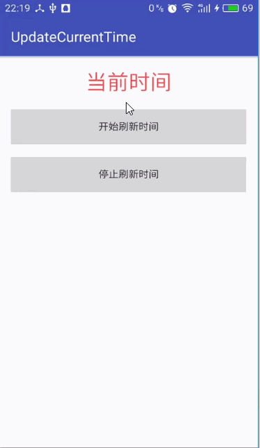

# UpdateCurrentTime
安卓两种方式实现刷新当前时间，计时器

Features
--------

- 方式一：使用Timer配合TimerTask，每隔1秒让Handler发一次消息
- 方式二：使用Handler每隔1秒发送消息，接收到消息后延迟1秒继续发送消息
- 自定义View `AutoCountTimeText`，利用方式一自动计时 

 
ScreenShot
---------

PS
---------
- 自定义View `AutoCountTimeText`，写完去百度才发现官方还有个`Chronometer`控件，功能更强大，瞬间感觉我的Low爆了(我还在想为什么Github上没人分享，醉了&#8230;)，但还是不要脸的push了。

- 第一次在Github上分享，勿怪勿怪，哈哈！